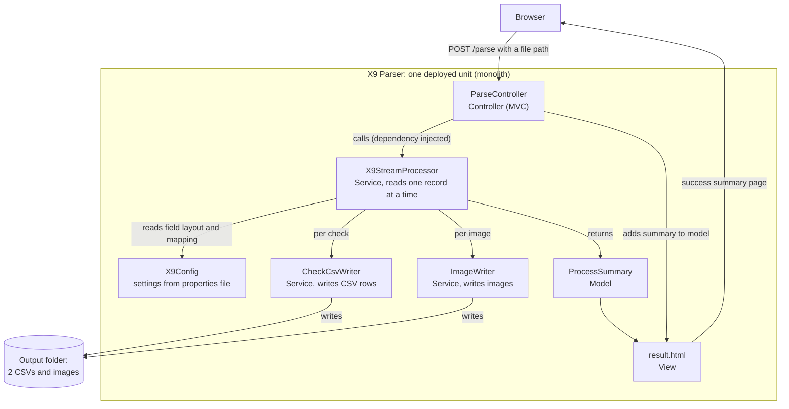

# Design Patterns in the X9 Parser

This project uses a small number of patterns that fit the problem, applied mostly through the Spring framework, rather than adding structure for its own sake.

## Patterns used in this project

### 1. Layered architecture

**What it is:** the code is split into layers, and each layer has one job.

The layers here:
- Controller (`ParseController`, `GlobalExceptionHandler`): handles the web request and response.
- Service (`X9StreamProcessor`, `CheckCsvWriter`, `ImageWriter`): does the real work of reading the file and writing the outputs.
- Model (`CheckRecord`, `ProcessSummary`): plain objects that carry data.
- Config (`X9Config`): the settings loaded from the properties file.

**Trade-off:** more classes and indirection than putting everything in one file. That cost is worth paying once the logic is non-trivial, and here it is what lets the parser be tested on its own, without the web layer.

**Where to see it:** the folder structure (`controller`, `service`, `model`, `config`) maps directly to the layers.

### 2. MVC (Model, View, Controller)

**What it is:** the web-specific version of the same idea, splitting a request into three roles. Spring MVC provides it.

- Controller: `ParseController` receives the request and decides what to do.
- Model: `ProcessSummary` carries the result (counts and output locations).
- View: Thymeleaf pages (`index.html`, `result.html`) render what the user sees.

**Trade-off:** an extra separation to maintain (logic in one place, templates in another). Worth it because the page and the logic change for different reasons and at different times.

**Where to see it:** `ParseController` returns a view name and puts a `ProcessSummary` in the model; Thymeleaf renders it.

### 3. Dependency Injection

**What it is:** a class does not create the things it needs. They are passed in from outside, through the constructor, and Spring supplies them.

**Trade-off:** it needs a framework (Spring) to wire everything together, and the wiring is less obvious than a direct `new`. In return the classes are decoupled and can be tested with fakes.

**Where to see it:**
- `ParseController(X9StreamProcessor processor)`
- `X9StreamProcessor(X9Config config)`

Neither class uses `new` to build its dependency. Spring creates each object and hands it to whoever needs it.

### 4. Singleton

**What it is:** one shared instance of a class exists, reused everywhere it is needed.

**Trade-off:** a single shared instance is used by many requests at the same time, so it must not hold changing state between requests, or those requests could interfere with each other. These services keep no state between calls (each
`process` call uses only local variables), so one shared instance is safe under concurrent load.

**Where to see it:** every Spring bean in the project is a singleton by default. `X9Config`, `X9StreamProcessor`, `CheckCsvWriter`, `ImageWriter`, and `ParseController` are each created once by Spring and shared.

**Note:** Singleton and Dependency Injection are provided by the Spring
framework. Spring creates one instance of each class (singleton) and passes it
to the classes that need it (injection).

## How a request flows through the patterns

A single request touches every pattern. This is the path it takes, from the browser to the output files and back:

Every object inside the box (the controller, the services, and the config) is a
singleton: Spring creates one of each and injects it where it is needed. Because
the services keep no state between requests, one shared instance handles many
requests safely.

## Architecture and deployment

- **Monolith:** the entire application (web layer, parsing, CSV writing, image writing) is one codebase, built and deployed as a single unit. For a focused, single-purpose tool this is the right choice.
- **Independent core:** the parsing logic in `X9StreamProcessor` does not depend on the web layer. It works from a file path and writes output, and the controller is a thin layer on top of it.
